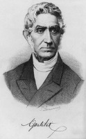
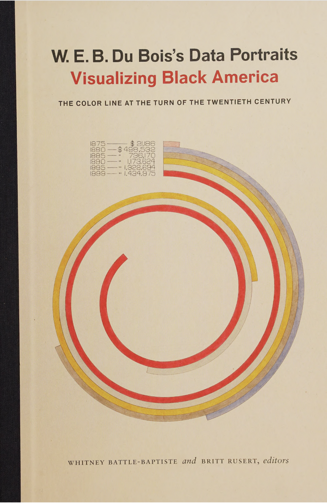

# Data, Justice, and Society - Week 3

Ngozi Harrison
ngozih@g.ucla.edu
Fall 2025
**Cluster 10A**  

---
### Overview
- Check in
- **Activity** Slave Voyages Database
- Foucault's theory of Biopower
- Biopower and the Origins of Statistics
- **Activity** Breaking down complex sentences

---
Our Readings This Week
- Ian Hacking, [1982] 2015. “Biopower and the Avalanche of Printed Numbers.” Humanities in Society 5: 279-295.
- Foucault, Society Defended, ch. 11
---
# Current News and Events
[Radiology combines digital images, clear benchmarks, and repeatable tasks. But replacing humans with AI is harder than it seems.](https://worksinprogress.co/issue/the-algorithm-will-see-you-now/)

---
# Hypothesis Annotations Check In
- Any issues creating annotations
- Reminder: Target 7-14 annotations
- At least one of each: Context, Thesis, Guidance, Question, Reaction, Comment

---

---
# Slave Voyages Activity (20min)

Imagine you are a researcher or data analyst working on a project and need data from the Slavevoyages data set. Pair with another student, explore the slavevoyages website, and develop a **research question** for your project. Next explain **how you would answer this question** using the dataset.

Write a discussion post of listing the names of the group members, the research question, and a potential way to answer the question

---
# Watch Biopower Video (10min)

---

# The Avalanche of Numbers and Biopower

---

# Introduction to Foucault
- French Theorist, Philosopher, Historian of Ideas
- (1926-1984)
- Studied under Jean Hyppolite and Louis Althusser, two prominent French philosophers
- Key Ideas: historical method of genealogy, history of ideas, history of sexuality, theories of power, panopticon, and many more

---

> “One may speak of bio-power to designate what brought life and its mechanisms into the realm of explicit calculation and made knowledge-power an agent of transformation of human life.” (Foucault, 1990) 

*As quoted in (Hacking, 2015, p. 279)*

---
> “One can tell the story of biopolitics as the transition from the counting of hearths to the counting of bodies. The subversive effect of this transition was to create new categories into which people had to fall, and so to create and to render rigid new conceptualizations of the human being.” (Hacking, 2015, p. 281)

---

> “Enumeration demands kinds of things or people to count. Counting is hungry for categories. Many of the categories we now use to describe people are byproducts of the needs of enumeration.” (Hacking, 2015, p. 280)

here Hacking illustrates how the avalanche of numbers and the enumeration of people brought about a new kind of power for the state to use. 

---
# The US Census and Computation

Hacking argues that enumeration is hungry for categories, in addition enumeration is also hungry for computation

Herman Hollerith submitted this patent in 1889 for punchcard machine to calculate and record statistical information for the 1890 census. He later went on to form IBM. Collection, storage,  analysis and prediction based on data has driven the need for more computation power

---

# How Data Happened

As a concept data emerges from the development of the modern concept of **science**, methods and innovations in **mathematics**, and **theological** arguments. From it's history in these particular disciplines, data inherits a claim to objectivity and truth

---
# Where Did Statistics Come From?

 'Statistik' was coined by Gottfried Achenwall in 1749 and he thought of what he called *statistics* as the collection of 'remarkable facts about the state'.

Statistics evolved out of the study and quantification of the state. Large scale efforts to take census, measure populations, and track state relevant metrics.

<!--printing press, publishing of statistics, sometimes was a private enterprise sometimes was state sponsored, statistics is one way of reading numbers-->
(Hacking, 1990)

---
### What is an Average

Mathematically we can represent an average as: 
$$
\overline x =  \frac{1}{n} \sum^n_{i=1}x_{i}
$$

but an average can also be a knowledge claim based on data, a specific kind of norm and way to measure deviation. This is the epistemological aspect of data.

---
# Quetelet and the Homme type

> “we thus arrive in inquiries of this kind, at the fundamental principle: that the greater the number of individuals observed, the more do individual particularities, whether physical or moral, become effaced, and leave in a prominent point of view the general facts, by virtue of which society exists and is preserved.”
— Adolphe Quetelet, 1835
---

Quetelet lays down the philosophical grounding for what an average is and what claims we can make about that data. Statistically we can define a common or average as a typical specimen

---
# Breaking down complex sentences

---
# Activity Breaking Down Complex Sentences (30min)
Activity Discussing our Annotations
- Break up into pairs and discuss your annotations and annotation process
- Identify one passage or sentence that you both highlighted
- Post a response to the discussion post containing the following
	- Define any words that are confusing 
	- Paraphrase this passage in your own words
	- What do you still have questions about in the passage? Is there anything that seems unclear, complex, or confusing?

---

# Upcoming Readings
- Selections, Battle-Baptiste, Whitney, and Britt Rusert. W.E.B Du Bois’s Data Portraits: Visualizing Black America. Princeton Architectural Press, 2018.