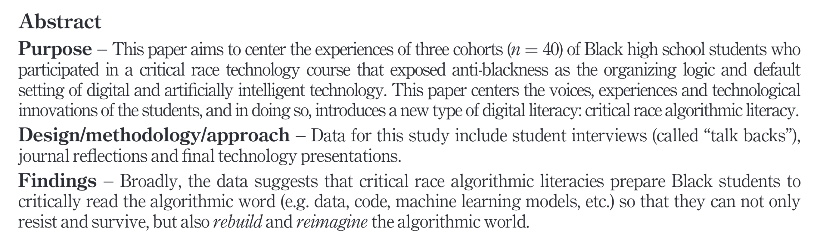

#  A Conversation on Critical Approaches to AI and Pedagogy 

Ngozi Harrison
Department of Information Studies, UCLA
Aug 22, 2024

---
# About Me
2nd year PhD Student in Department of Information Studies, UCLA
UCLA Cota-Robles Fellow and Center for Race and Digital Justice Fellow
**Previously** Creative Effectiveness Lead @ Google

**Areas of Interest** Critical AI Studies, Formal Reasoning and Computation, Race and Digital Justice, Knowledge Organization

**Research Topic**  My research focuses on examining the mathematical, conceptual, and logical foundations of information systems and computation. I seek to explore non-western logics and modes of computation to develop liberatory frameworks for information science.

---
# Overview
- What is Artificial Intelligence
- The Current AI Landscape
- Critical Perspectives on Large Language Models
- My Perspective on AI
- AI as a Student Researcher
- Pedagogy and Teaching in the Era of AI

---
# On Methodology

---

---
# Analyzing the Sociotechnical
We can understand any technology as an assemblage composed of the **artifact**, **practices**, and **beliefs** (Brock 2020). Analyzing technologies allows us to develop concepts that both have explanatory power and allow for a radical rethinking of the present toward more just futures. There many frameworks for the critical analysis of technology including **Critical Race Theory**, **Feminist Analysis**, **Black Digital Feminism**, **Marxism** and **Political Economy**, etc.

---
# My goal in thinking about AI is to raise our collective critical sociotechnical consciousness where we don’t simply accept the terms set for us my corporate companies but refuse, reimagine, and reappropriate technologies so serve other purposes

---
# From Algorithms to AI
According to Tufekci, algorithms are “computational agents who are not alive but act in the world” [(Tufekci 2015)](https://www.zotero.org/google-docs/?hJIKWI). Benjamin extends this definition by calling them “formalizations” that enforce racialized meanings and contribute to the constitution of the world [(Benjamin 2019)](https://www.zotero.org/google-docs/?lGcgRI). 

---

---
# What is AI?

---
# A Working Definition of Artificial Intelligence

Artificial Intelligence as concept can be defined the ability of a computer system to perform tasks and that are traditionally thought to require human intelligence. Artificial Intelligence systems collections of data, algorithms, and various components that use the techniques of the discipline of AI and ML research.

---
# What Are LLMs
Large Language models are a type of natural language processing model that are trained on massive data sets and use machine learning algorithms infer patterns and structures in human language. When LLMs generate responses they are not necessarily reasoning but using advanced probabilistic methods to respond in a way that mimic prior data in the dataset

---
# Current Popular Models

<section class = "columns">

**ChatGPT-4**
Latest Model from OpenAI
Initial Release in November 2022
Microsoft is a big investor and strategic partner

**Claude 3.5**
Developed by Anthropic, founders split from OpenAI
Initial Release in March 2023

</section>

---
# Current Popular Models Cont'd
<section class = "columns">

**Gemini**
Developed by Google
Initial Release in 
Multimodal family of models, successor to Lambda and PaLM 2

**LLaMA**
Developed by Facebook/Meta
Open source
Released in 2023
</section>

---
# Key Issues in AI Today
- Ethics, Fairness, and Accountability in the use of AI systems
- Misinformation/Disinformation
- Environmental Impact of AI
- Algorithmic bias
- Intellectual Property and Regulation
- AI, Military, and Surveillence

---

Estimates have shown training GPT-3 in Microsoft’s  data centers can directly use 700,000 liters of clean freshwater (Li et al., 2023)

---
# AI as we know it, is probably a bubble

---
# How are you currently using AI?   What are the benefits?   What concerns do you have about AI?
---

# Using LLMs as a Student Researcher
Increasingly there are new tools marketed toward students and researchers to make our lives easier. There are general tools such as **ChatGPT** and **Claude** in addition to more specific tools like **Grammarly** and search engines such as **Perplexity.AI**

---

# How I Use AI
Due to some of the accuracy, and ethical/social concerns with AI systems I advocate for careful consideration and use of AI tools within research practice. 
Current ways I use AI tools:
- Finding research articles and sources
- Editing and grammer
- Brainstorming and outlining
- Writing emails

**Remember:** there's more to AI tools than LLMs

---
# AI and Ethics

> “In essence, the **future of AI and ethics should be concerned with rising global social and economic inequality**, the repercussions that will emerge as an effect of climate change, and the ways in which AI will be used in the redistribution of global goods and services—from housing, to food, to border-crossing, and beyond. Broadly, those of us in the fields of digital social research must center the issues of social, political, and economic inequality as an orientation to **studying lived experiences in relation to structures of power that algorithms, AI, and automated systems can overdetermine**—rather than assuming that technology itself can be ethically perfected or that bias is a feature of a AI or externality that can be corrected or resolved.” (Le Bui and Noble, 2020, p. 10)

---
# AI , Authorship & Copyright
Currently copyright law and regulation on AI is still unfolding, both globally and in the US. This means as scholars we have have to stay informed as things quickly change and we have some influence on what the future looks like.
**Things to Know:**
- Generative Models and LLMs have been shown to be trained using copyrighted material
- Nature, and Science are two example journals have judged writing our sources authored or coauthored using AI technologies do not meet their criteria
- Elsevier requires disclosure of use of AI

---
# Using AI in Qualitative Research Analysis
Davison et al. identify ethical issues in relation to the use of AI for analysis of qualitative data:
- Data ownership and rights
- Data privacy and transparency
- Interpretive sufficiency
- Biases manifested in Generative Artificial Intelligence (GAI)
- Researcher responsibilities and agency
The argue for building evolving *living guidelines*, researcher responsibility and transparency and robust ethical frameworks

---

---

# How are you thinking about AI and Pedagogy?

---

# Pedagogy and Teaching in the Era of AI

---

---
# How Do We Prepare Students to Enter a World with AI
Students need **information literacy**, **critical algorithm skills**, and the tools to innovate using technologies and imagine **just futures**

This means not just teaching students how to use technology, but critically about AI technologies and imagine more just futures

---
# AI technologies and systems are here for now, but what the future will look like is still being determined. We can imagine just and equitable futures

---
# Sources
Benjamin, R. (2019). _Race After Technology: Abolitionist Tools for the New Jim Code_ (1st edition). Polity.
Brock, A. (2018). Critical technocultural discourse analysis. _New Media & Society_, _20_(3), 1012–1030. [https://doi.org/10.1177/1461444816677532](https://doi.org/10.1177/1461444816677532)
Davison, R. M., Chughtai, H., Nielsen, P., Marabelli, M., Iannacci, F., van Offenbeek, M., Tarafdar, M., Trenz, M., Techatassanasoontorn, A. A., Díaz Andrade, A., & Panteli, N. (n.d.). The ethics of using generative AI for qualitative data analysis. _Information Systems Journal_, _n/a_(n/a). [https://doi.org/10.1111/isj.12504](https://doi.org/10.1111/isj.12504)
Huber, L. P., Vélez, V. N., & Malagón, M. C. (2024). Charting methodological imaginaries: Critical Race Feminista Methodologies in educational research. _International Journal of Qualitative Studies in Education_, _37_(5), 1263–1271. [https://doi.org/10.1080/09518398.2024.2318296](https://doi.org/10.1080/09518398.2024.2318296)
Le Bui, M., & Noble, S. U. (2020). We’re Missing a Moral Framework of Justice in Artificial Intelligence: On the Limits, Failings, and Ethics of Fairness. In M. D. Dubber, F. Pasquale, & S. Das (Eds.), _The Oxford Handbook of Ethics of AI_ (pp. 161–179). Oxford University Press. [https://doi.org/10.1093/oxfordhb/9780190067397.013.9](https://doi.org/10.1093/oxfordhb/9780190067397.013.9)
Li, P., Yang, J., Islam, M. A., & Ren, S. (2023). _Making AI Less “Thirsty”: Uncovering and Addressing the Secret Water Footprint of AI Models_ (arXiv:2304.03271). arXiv. [http://arxiv.org/abs/2304.03271](http://arxiv.org/abs/2304.03271)
Tanksley, T. C. (2024). “We’re changing the system with this one”: Black students using critical race algorithmic literacies to subvert and survive AI-mediated racism in school. _English Teaching: Practice & Critique_, _23_(1), 36–56. [https://doi.org/10.1108/ETPC-08-2023-0102](https://doi.org/10.1108/ETPC-08-2023-0102)
Tufekci, Z. (2015). Algorithmic harms beyond Facebook and Google: Emergent challenges of computational agency. _Colo. Tech. LJ_, _13_, 203.
Villa-Nicholas, M. (2019). Latinx Digital Memory: Identity Making in Real Time. _Social Media + Society_, _5_(4), 2056305119862643. [https://doi.org/10.1177/2056305119862643](https://doi.org/10.1177/2056305119862643)

---
# Additional Reading and Links

[Artificial Intelligence (Generative) Resources from Georgetown Library](https://guides.library.georgetown.edu/ai/tools#s-lg-box-31586691)
[Essential books by Scholars of Color scholars on tech, science, & race](https://www.raceanddigitaljustice.org/essentialreading)
[Data & Society](https://datasociety.net/)
[Hugging Face](https://huggingface.co/)
[Center for Race and Digital Justice]()
[A Sociotechnical Approach to AI Policy](https://datasociety.net/library/a-sociotechnical-approach-to-ai-policy/)
[Comments to Consumer Financial Protection Bureau regarding Collection and Sale of Consumer Information](https://www.raceanddigitaljustice.org/_files/ugd/75337c_badd9e7b13cb47429651b2dffebefbc1.pdf)
[Sequoia Capital Report](https://www.sequoiacap.com/article/ais-600b-question/)
[Goldman Sachs report](https://www.goldmansachs.com/images/migrated/insights/pages/gs-research/gen-ai--too-much-spend,-too-little-benefit-/TOM_AI%202.0_ForRedaction.pdf)

---
# Links
Twitter: @kingnegritude
Linkedin: linkedin.com/in/ngozi-harrison
Website: [kingnegritude.cargo.site](https://kingnegritude.cargo.site/)